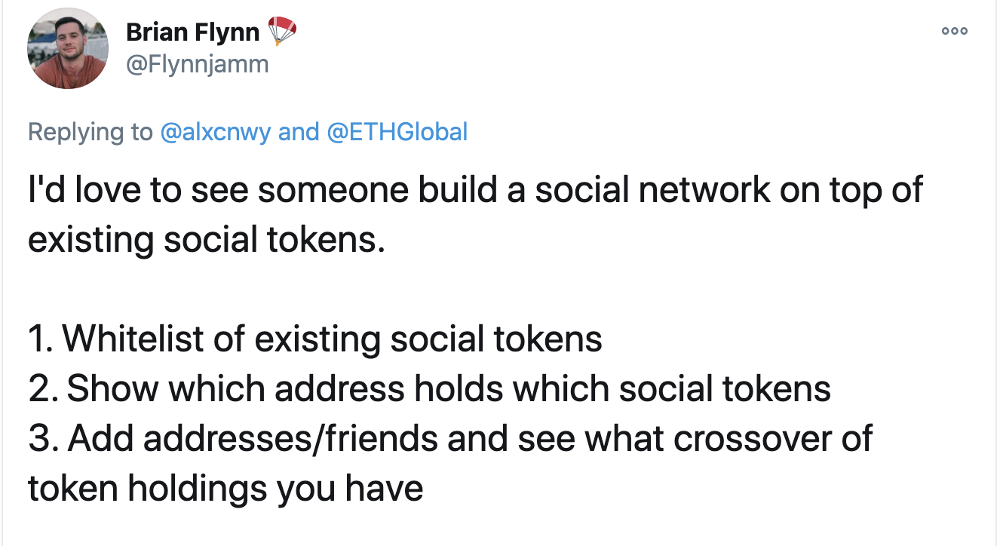

# Stuck with u

## Team

- [@makoto_inoue](https://twitter.com/@makoto_inoue)

## Short Description of what you’ve built

a social network on top of existing social tokens.

- Whitelist of existing social tokens
- Show which address holds which social tokens
- Add addresses/friends and see what crossover of token holdings you have
- ENS name and thier NFT token assets of top token 10 holders for each personal tokn

[Inspiration](https://twitter.com/Flynnjamm/status/1313182142935883776)

## Link to a video, demo or slide deck

- [Demo video](https://youtu.be/bHpcAekEyeE)

Link to a live demo or working Project.

- [stuckwithu.eth.link](https://stuckwithu.eth.link)

## APIs used

### [TryRoll](https://docs.tryroll.com)

- Get list of tokens

### [Subgraph](https://thegraph.com/explorer/subgraph/uniswap/uniswap-v2)

- Retrieve current Uniswap price

### [Covalenthq](https://www.covalenthq.com/)

- Retrieve token holdings

### [OpenSea](https://docs.opensea.io/reference)

- Retrieve NFT assets of top NFT holders

## Todo

- Support other Personal Token platforms (Rally/StakeOnMe)
- Show when your friends bought/sold/transferred tokens
- Speed up/Cache ENS lookup

